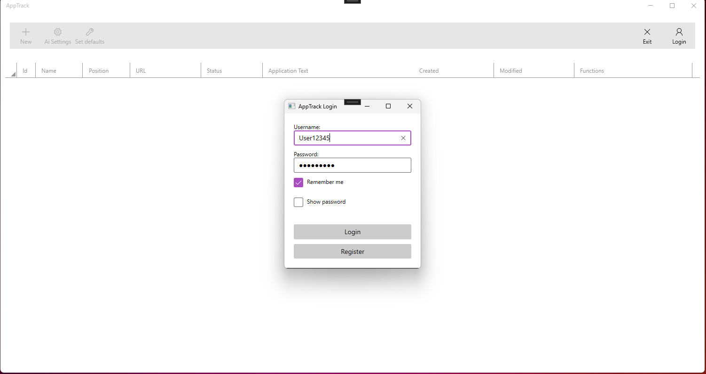
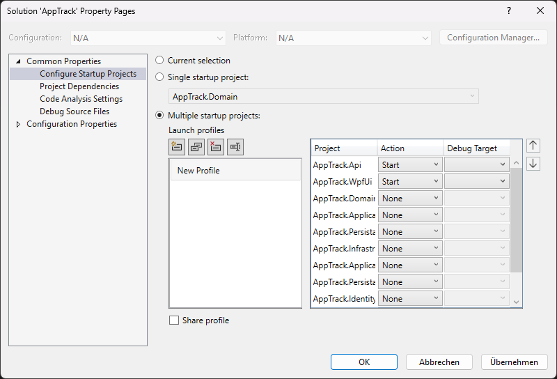

# AppTrack

)

AppTrack helps me manage my own job applications and generate application texts using AI (work in progress). It features Bearer-Token Authentication, a WPF frontend, with a Blazor web frontend planned for the future. The backend is an ASP.NET Web API (all .NET 8) following Clean Architecture, CQRS, and the Mediator pattern. 
The project is primarily intended as a playground for exploring new technologies and architectures.

## Features
- Manage personal job applications
- Generate application texts using AI
- WPF desktop frontend (Blazor web frontend planned)
- ASP.NET Web API backend with Clean Architecture, CQRS, and Mediator pattern

## Installation
1. Clone the repository:
   ```bash
   git clone https://github.com/wagnersoftware/AppTrack.git
2. Open the solution in Visual Studio 2022 or later.

3. Restore NuGet packages.

4. Run the backend and frontend projects. (right click on solution -> Properties

)

5. Run the database migrations in packet-manager
   ```bash
   update-database -context AppTrackDatabaseContext
   update-database -context AppTrackIdentityDbContext

## Contributing

1. Fork the repository.

2. Create a new branch for your feature or bugfix.

3. Submit a Pull Request.

## License

This project is licensed under the MIT License.
