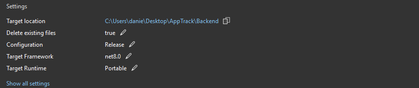
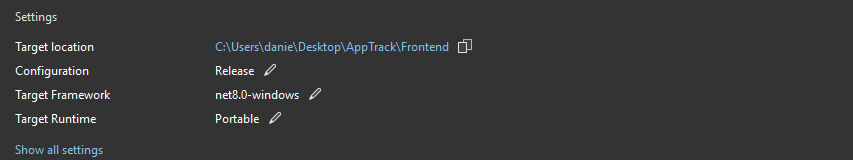
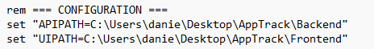

# AppTrack


AppTrack helps me manage my own job applications and generate application texts using AI (work in progress). It features Bearer-Token authentication, a WPF frontend, with a Blazor web frontend planned for the future. The backend is an ASP.NET Web API (all .NET 8) following Clean Architecture, CQRS, and the Mediator pattern. 
The project is primarily intended as a playground for exploring new technologies and architectures.

## Features
- Manage personal job applications

- Generate application texts using AI

- Token-based authentication

- WPF desktop frontend (Blazor web frontend planned)

- WPF implemented with MVVM and CommunityToolkit.Mvvm

- XAML Styler for consistent code style

- ASP.NET Web API backend with Clean Architecture, CQRS, and the Mediator pattern

- Dependency Injection

- Clean Code and SOLID principles

- API client generation with NSwag

- AutoMapper

- FluentValidation

- ModernWpfUI controls

- Unit tests with xUnit, Moq and Shouldly

- Integration tests with Docker Testcontainers, Xunit and Shouldly

- Static code analysis with SonarAnalyzer.CSharp

- Entity Framework Core

- MS SQL LocalDB


## Installation
1. Clone the repository:
   ```bash
   git clone https://github.com/wagnersoftware/AppTrack.git
2. Open the solution in Visual Studio 2022 or later.

3. Right-click on the solution file -> Restore NuGet packages.

4. Right-click the project file AppTrack.Api and select Publish. Choose any directory on your local machine, apply the settings and run Publish.



5. Right-click the project file AppTrack.WpfUi and select Publish. Choose any directory on your local machine, apply the settings and run Publish.



6. In the Frontend directory there is a batch file (StartAppTrack.bat) that will run the frontend and backend. you must set the APIPATH and UIPATH to your installation directory.



7. Run the batch file

The application uses LocalDB that comes with Visual Studio. If you still need it, you can get it here (Express Version): https://www.microsoft.com/en-us/sql-server/sql-server-downloads
The migration scripts run automatically on server start.

## Contributing

1. Fork the repository.

2. Create a new branch for your feature or bugfix.

3. Submit a Pull Request.

## License

This project is licensed under the MIT License.
