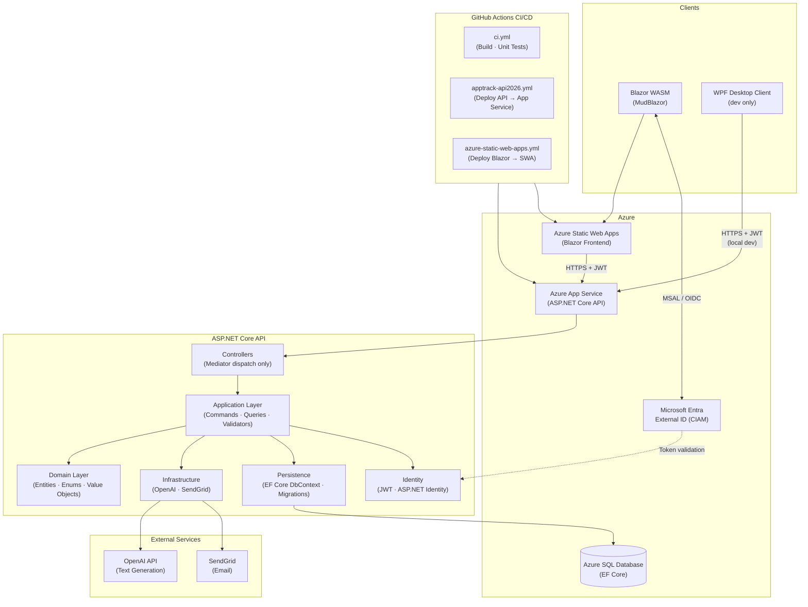

# AppTrack

> AI-powered job application management — built as a playground for Clean Architecture, CQRS, and modern .NET cloud patterns.


AppTrack lets you track job applications and generate tailored application texts with OpenAI. The backend follows **Clean Architecture** with CQRS and the Mediator pattern. The web frontend is a **Blazor WebAssembly** SPA protected by **Microsoft Entra External ID (CIAM)**. Both are deployed to Azure via GitHub Actions CD pipelines.

---

## Architecture


```mermaid
graph TB
    subgraph Clients["Clients"]
        Blazor["Blazor WASM\n(MudBlazor)"]
        WPF["WPF Desktop Client\n(dev only)"]
    end

    subgraph Azure["Azure"]
        SWA["Azure Static Web Apps\n(Blazor Frontend)"]
        AppSvc["Azure App Service\n(ASP.NET Core API)"]
        EntraID["Microsoft Entra\nExternal ID (CIAM)"]
        AzureSQL[("Azure SQL Database\n(EF Core)")]
    end

    subgraph ExternalServices["External Services"]
        OpenAI["OpenAI API\n(Text Generation)"]
        SendGrid["SendGrid\n(Email)"]
    end

    subgraph API["ASP.NET Core API"]
        Controllers["Controllers\n(Mediator dispatch only)"]
        Application["Application Layer\n(Commands · Queries · Validators)"]
        Domain["Domain Layer\n(Entities · Enums · Value Objects)"]
        Infra["Infrastructure\n(OpenAI · SendGrid)"]
        Persistence["Persistence\n(EF Core DbContext · Migrations)"]
        Identity["Identity\n(JWT · ASP.NET Identity)"]
    end

    subgraph CI_CD["GitHub Actions CI/CD"]
        CI["ci.yml\n(Build · Unit Tests)"]
        CDApi["apptrack-api2026.yml\n(Deploy API → App Service)"]
        CDBlazor["azure-static-web-apps.yml\n(Deploy Blazor → SWA)"]
    end

    Blazor --> SWA
    SWA -->|"HTTPS + JWT"| AppSvc
    WPF -->|"HTTPS + JWT\n(local dev)"| AppSvc
    Blazor <-->|"MSAL / OIDC"| EntraID
    EntraID -.->|"Token validation"| Identity

    AppSvc --> Controllers
    Controllers --> Application
    Application --> Domain
    Application --> Infra
    Application --> Persistence
    Application --> Identity
    Persistence --> AzureSQL
    Infra --> OpenAI
    Infra --> SendGrid

    CI_CD --> AppSvc
    CI_CD --> SWA
```

### Layers

| Layer | Project | Responsibility |
|-------|---------|----------------|
| Domain | `AppTrack.Domain` | Entities, enums, value objects — no dependencies |
| Application | `AppTrack.Application` | CQRS handlers, DTOs, validators, mapping |
| Infrastructure | `AppTrack.Infrastructure` | OpenAI text generation, SendGrid email |
| Persistence | `AppTrack.Persistance` | EF Core DbContext, migrations (auto-applied on startup) |
| Identity | `AppTrack.Identity` | JWT generation/validation, ASP.NET Identity |
| API | `AppTrack.Api` | ASP.NET controllers, middleware, DI wiring |
| Shared | `AppTrack.Shared.Validation` | Shared FluentValidation interfaces & base validators |
| Frontend | `AppTrack.Frontend.Models` / `ApiService` | Shared DTOs, NSwag-generated API client |

---

## Tech Stack

**Backend**
- .NET 10 / ASP.NET Core Web API
- Custom Mediator implementation (CQRS pattern, no third-party library)
- Entity Framework Core 10 + MS SQL Server
- FluentValidation
- JWT Bearer authentication
- SonarAnalyzer.CSharp (static analysis, warnings-as-errors)

**Frontend**
- Blazor WebAssembly (net10.0)
- MudBlazor component library
- MSAL.js via `Microsoft.Authentication.WebAssembly.Msal`
- NSwag-generated typed API client

**Cloud & DevOps**
- Azure App Service (API)
- Azure Static Web Apps (Blazor SPA)
- Microsoft Entra External ID — CIAM (authentication)
- GitHub Actions — CI pipeline + two CD pipelines (OIDC / Federated Identity, no long-lived secrets)

**Testing**
- xUnit · Moq · Shouldly (unit tests)
- EF Core InMemory (persistence integration tests)
- Testcontainers + real SQL Server in Docker (API integration tests)

---

## Getting Started (Local Development)

### Prerequisites
- .NET 10 SDK
- Visual Studio 2022 17.12+ or VS Code
- SQL Server LocalDB (ships with Visual Studio)
- Docker Desktop (for API integration tests only)

### Run locally

```bash
# Clone
git clone https://github.com/wagnersoftware/AppTrack.git
cd AppTrack

# Restore & build
dotnet restore AppTrack.sln
dotnet build AppTrack.sln --configuration Release

# Start the API (migrations apply automatically on first run)
dotnet run --project AppTrack.Api

# Start the Blazor frontend (separate terminal)
dotnet run --project AppTrack.BlazorUi
```

### Run tests

```bash
# Unit tests
dotnet test test/AppTrack.Application.UnitTests/AppTrack.Application.UnitTests.csproj

# Persistence integration tests (LocalDB)
dotnet test test/AppTrack.Persistance.IntegrationTests/AppTrack.Persistance.IntegrationTests.csproj

# API integration tests (requires Docker)
dotnet test test/AppTrack.Api.IntegrationTests/AppTrack.Api.IntegrationTests.csproj
```

### Configuration

Key settings in `AppTrack.Api/appsettings.json` — override via user secrets or environment variables:

| Key | Description |
|-----|-------------|
| `ConnectionStrings:DefaultConnection` | SQL Server connection string |
| `JwtSettings:Key` | JWT signing key |
| `OpenAiSettings:ApiUrl` | OpenAI API endpoint |
| `EmailSettings:ApiKey` | SendGrid API key |

> A WPF desktop client (`AppTrack.WpfUi`) is also included for local use, though the Blazor frontend is the primary UI.

---

## CI/CD

| Workflow | Trigger | Action |
|----------|---------|--------|
| `ci.yml` | Push / PR | Build + unit tests |
| `apptrack-api2026.yml` | Push to `main` | Deploy API → Azure App Service (OIDC) |
| `azure-static-web-apps-*.yml` | Push to `main` | Deploy Blazor → Azure Static Web Apps |

---

## Contributing

1. Fork the repository.
2. Create a branch: `git checkout -b feature/your-feature`.
3. Submit a Pull Request against `main`.

---

## License

This project is licensed under the [MIT License](LICENSE).
