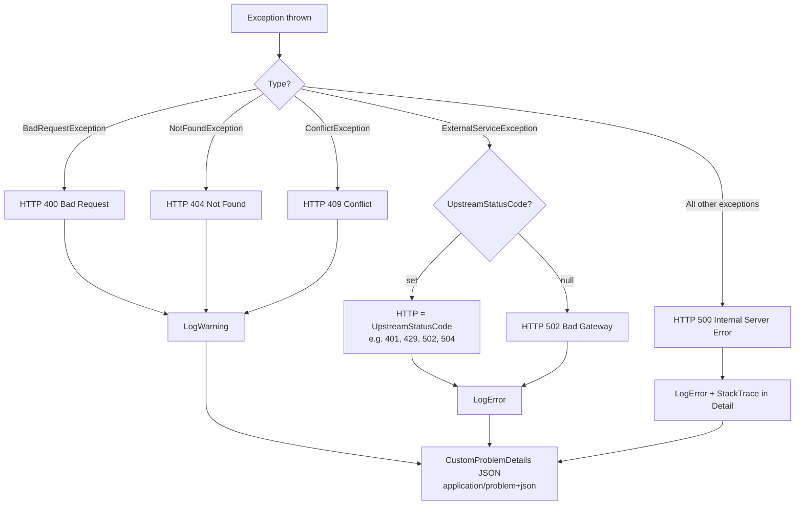
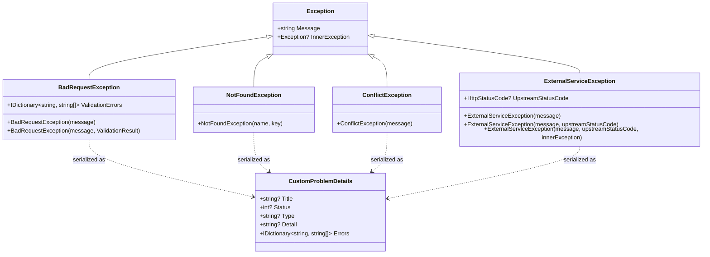

# Error Handling Architecture

## Overview

AppTrack uses a consistent, cross-layer error handling strategy. The core principle is: **errors are thrown where they occur and converted into a uniform format at a single central point per layer.**

| Layer | Responsibility |
|---|---|
| `AppTrack.Application` | Defines typed exceptions (`BadRequestException`, `NotFoundException`, etc.) |
| `AppTrack.Infrastructure` | Maps external HTTP errors to `ExternalServiceException` |
| `AppTrack.Api` | `ExceptionMiddleware` converts all exceptions to `CustomProblemDetails` JSON |
| `AppTrack.Frontend.ApiService` | `BaseHttpService.TryExecuteAsync` converts HTTP errors to `Response<T>` |
| `AppTrack.BlazorUi` | `IErrorHandlingService.HandleResponse` displays errors as MudBlazor snackbar |
| `AppTrack.WpfUi` | `IMessageBoxService.ShowErrorMessageBox` displays errors as WPF message box |

This pattern ensures that UI components never contain try/catch blocks or direct HTTP status code evaluation.

---

## Error Flow: 400 Validation Error (Primary Example)

The following diagram shows the full journey of a failed `CreateJobApplication` call from the Blazor UI.

```mermaid
sequenceDiagram
    participant UI as Blazor Component<br/>(CreateJobApplicationDialog)
    participant SVC as JobApplicationService<br/>(BaseHttpService)
    participant API as JobApplicationsController<br/>(AppTrack.Api)
    participant MED as IMediator
    participant HDL as CreateJobApplicationCommandHandler
    participant VAL as CreateJobApplicationCommandValidator
    participant MDW as ExceptionMiddleware

    UI->>SVC: CreateJobApplicationForUserAsync(_model)
    SVC->>SVC: TryExecuteAsync(...)
    SVC->>API: POST /api/jobapplications (HTTP)
    API->>MED: Send(CreateJobApplicationCommand)
    MED->>HDL: Handle(command, cancellationToken)
    HDL->>VAL: ValidateAsync(command)
    VAL-->>HDL: ValidationResult (with errors)
    HDL->>HDL: throw BadRequestException("Invalid Request", validationResult)
    Note over HDL,MDW: Exception propagates through Mediator and Controller
    MDW->>MDW: catch BadRequestException
    MDW-->>API: HTTP 400 + CustomProblemDetails JSON
    Note over MDW: { title, status: 400, errors: { "Name": ["..."] } }
    API-->>SVC: ApiException (StatusCode: 400)
    SVC->>SVC: ConvertApiException()<br/>→ ApiErrorHelper.ExtractErrors()
    SVC-->>UI: Response&lt;T&gt; { Success=false, ErrorMessage="...", ErrorDetails="..." }
    Note right of SVC: ErrorMessage="Invalid data was submitted"<br/>ErrorDetails="Status: 400 / Message: Invalid Request / Name: ..."
    UI->>UI: ErrorHandlingService.HandleResponse(response)
    Note over UI: HandleResponse returns false
    UI->>UI: Snackbar shows response.DisplayMessage
```

---

## Exception Types and HTTP Status Codes



### Special Case: `BadRequestException.ValidationErrors`

`BadRequestException` can carry an `IDictionary<string, string[]>` with field-level errors. These are forwarded in the `CustomProblemDetails.Errors` dictionary and formatted line-by-line by `ApiErrorHelper`.



---

## Layer-by-Layer Description

### 1. Domain Exceptions (`AppTrack.Application/Exceptions/`)

All exceptions are plain C# classes with no framework dependencies. They serve as **semantic signals** — indicating what kind of error occurred, independent of the transport protocol.

**`BadRequestException`** — invalid client input, typically FluentValidation failures:

```csharp
// From CreateJobApplicationCommandHandler.cs
var validationResult = await validator.ValidateAsync(request);

if (validationResult.Errors.Any())
{
    throw new BadRequestException("Invalid Request", validationResult);
}
```

The constructor `BadRequestException(string, ValidationResult)` internally calls `validationResult.ToDictionary()` and populates `ValidationErrors`.

**`NotFoundException`** — requested resource not found:

```csharp
throw new NotFoundException(nameof(JobApplication), request.Id);
// Produces the message: "JobApplication 42 not found"
```

**`ConflictException`** — logical conflict (not yet actively used):

```csharp
throw new ConflictException("A record with this name already exists.");
```

**`ExternalServiceException`** — errors from third-party services (OpenAI, SendGrid):

```csharp
throw new ExternalServiceException(
    "OpenAI rate limit exceeded. Please try again later.",
    HttpStatusCode.TooManyRequests);
```

---

### 2. OpenAI Error Handling (`AppTrack.Infrastructure`)

`OpenAiApplicationTextGenerator` is the only place that performs direct HTTP communication with an external service. Raw HTTP status codes and network errors are converted to `ExternalServiceException` with semantically correct `UpstreamStatusCode` values:

```csharp
// TaskCanceledException: distinguish timeout from client cancellation
catch (TaskCanceledException ex)
{
    if (!cancellationToken.IsCancellationRequested)
        throw new ExternalServiceException("The request to OpenAI timed out.", HttpStatusCode.GatewayTimeout, ex);
    throw; // Client cancelled intentionally — not an error on our side
}

// Map HTTP error responses by status code
throw response.StatusCode switch
{
    HttpStatusCode.Unauthorized =>
        new ExternalServiceException("OpenAI API key is invalid or expired.", HttpStatusCode.Unauthorized),
    HttpStatusCode.TooManyRequests =>
        new ExternalServiceException("OpenAI rate limit exceeded.", HttpStatusCode.TooManyRequests),
    HttpStatusCode.ServiceUnavailable or HttpStatusCode.GatewayTimeout =>
        new ExternalServiceException("OpenAI service is currently unavailable.", response.StatusCode),
    _ =>
        new ExternalServiceException($"OpenAI returned an unexpected error: {(int)response.StatusCode}", response.StatusCode)
};

// Empty response
if (string.IsNullOrWhiteSpace(content))
    throw new ExternalServiceException("OpenAI returned an empty response.");
```

**Result:** The middleware always receives an `ExternalServiceException` — never a raw `HttpRequestException`.

---

### 3. ExceptionMiddleware (`AppTrack.Api/Middleware/ExceptionMiddleware.cs`)

The middleware is the **single point** where exceptions are converted to HTTP responses. Controllers contain no try/catch.

```csharp
switch (ex)
{
    case BadRequestException badRequestException:
        statusCode = HttpStatusCode.BadRequest;
        problem = new CustomProblemDetails()
        {
            Title  = badRequestException.Message.Trim(),
            Status = (int)statusCode,
            Detail = badRequestException.InnerException?.Message,
            Type   = nameof(BadRequestException),
            Errors = badRequestException.ValidationErrors   // field-level validation errors
        };
        break;

    case ExternalServiceException extEx:
        statusCode = extEx.UpstreamStatusCode ?? HttpStatusCode.BadGateway;
        // ...LogError (not just LogWarning)
        break;

    default:
        // 500: StackTrace is included in Detail (useful in Development only)
        problem = new CustomProblemDetails() { Detail = ex.StackTrace, ... };
        break;
}

httpContext.Response.ContentType = "application/problem+json";
await httpContext.Response.WriteAsJsonAsync(problem);
```

**Logging strategy:**
- `BadRequestException`, `NotFoundException`, `ConflictException` → `LogWarning` (expected client errors)
- `ExternalServiceException`, unhandled exceptions → `LogError`

---

### 4. `CustomProblemDetails` — the Wire Format

```json
{
  "title": "Invalid Request",
  "status": 400,
  "type": "BadRequestException",
  "detail": null,
  "errors": {
    "Name": ["'Name' must not be empty."],
    "StartDate": ["'StartDate' must not be empty."]
  }
}
```

`CustomProblemDetails` extends `Microsoft.AspNetCore.Mvc.ProblemDetails` with the `Errors` dictionary:

```csharp
public class CustomProblemDetails : ProblemDetails
{
    public IDictionary<string, string[]> Errors { get; set; } = new Dictionary<string, string[]>();
}
```

---

### 5. `Response<T>` — the Frontend Container (`AppTrack.Frontend.ApiService/Base/Response.cs`)

```csharp
public class Response<T>
{
    public string ErrorMessage { get; set; } = string.Empty;   // Generic, user-friendly message (hardcoded)
    public string ErrorDetails { get; set; } = string.Empty;   // Formatted backend details (status + fields)
    public string DisplayMessage => !string.IsNullOrEmpty(ErrorDetails) ? ErrorDetails : ErrorMessage;
    public bool Success { get; set; }
    public T? Data { get; set; }
}
```

| Property | On error | On success |
|---|---|---|
| `Success` | `false` | `true` |
| `ErrorMessage` | Hardcoded UI message (e.g. `"Invalid data was submitted"`) | `""` |
| `ErrorDetails` | Formatted string from `ApiErrorHelper` | `""` |
| `DisplayMessage` | `ErrorDetails` if available, otherwise `ErrorMessage` | `""` |
| `Data` | `null` or default | contains the result |

**Rule:** Always use `DisplayMessage` in the frontend — never access `ErrorMessage` or `ErrorDetails` directly.

---

### 6. `BaseHttpService.TryExecuteAsync` (`AppTrack.Frontend.ApiService/Base/BaseHttpService.cs`)

All service methods in `AppTrack.Frontend.ApiService` are wrapped in `TryExecuteAsync`. This ensures that **no exception ever reaches the caller** — a `Response<T>` is always returned instead:

```csharp
protected async Task<Response<T>> TryExecuteAsync<T>(Func<Task<T>> action)
{
    try
    {
        var result = await action();
        return new Response<T> { Success = true, Data = result };
    }
    catch (AccessTokenNotAvailableException ex)
    {
        ex.Redirect(); // Redirects to MSAL login page
        return new Response<T> { Success = false, ErrorMessage = "Session expired. Redirecting to login..." };
    }
    catch (OperationCanceledException)
    {
        return new Response<T> { Success = false, ErrorMessage = "Operation canceled." };
    }
    catch (ApiException e)
    {
        return ConvertApiException<T>(e); // HTTP status code → ErrorMessage + ErrorDetails
    }
    catch (Exception)
    {
        return new Response<T> { Success = false, ErrorMessage = "Something went wrong, please try again" };
    }
}
```

**`ConvertApiException`** maps HTTP status codes to fixed `ErrorMessage` strings and calls `ApiErrorHelper.ExtractErrors`:

| HTTP status code | `ErrorMessage` |
|---|---|
| 400 | `"Invalid data was submitted"` |
| 404 | `"The record was not found"` |
| All others | `"Something went wrong, please try again"` |

---

### 7. `ApiErrorHelper` (`AppTrack.Frontend.ApiService/Helper/ApiErrorHelper.cs`)

Converts a `CustomProblemDetails` object (or its JSON representation) into a readable, multi-line string:

```
Status: 400
Message: Invalid Request
Name: 'Name' must not be empty.
StartDate: 'StartDate' must not be empty.
```

This string is stored in `Response<T>.ErrorDetails` and delivered to the UI via `DisplayMessage`.

---

### 8. Blazor Frontend: `IErrorHandlingService` (`AppTrack.BlazorUi/Services/ErrorHandlingService.cs`)

```csharp
public bool HandleResponse<T>(Response<T> response)
{
    if (response.Success) return true;
    snackbar.Add(response.DisplayMessage, Severity.Error);
    return false;
}
```

The `bool` return value enables the idiomatic guard pattern in components.

---

### 9. WPF Frontend: `IMessageBoxService` (`AppTrack.WpfUi/MessageBoxService/MessageBoxService.cs`)

```csharp
public MessageBoxResult ShowErrorMessageBox<T>(Response<T> response)
{
    var message = response.DisplayMessage;
    // shows WPF MessageBox with the active window as owner
}
```

In the WPF MVVM pattern, ViewModels check `response.Success` directly and set an `ErrorMessage` observable property for inline display in the view:

```csharp
// From LoginViewModel.cs
var apiResponse = await _authenticationService.AuthenticateAsync(Model);
if (apiResponse.Success == false)
{
    ErrorMessage = apiResponse.DisplayMessage;
    return;
}
```

---

## Frontend Usage Guide

### Blazor: Standard Pattern with `HandleResponse`

This pattern is the **default** for all write operations in Blazor components.

```csharp
private async Task SubmitAsync()
{
    // 1. Frontend validation first (avoids unnecessary API call)
    if (!ModelValidator.Validate(_model)) return;

    // 2. Call the API
    _isBusy = true;
    var response = await JobApplicationService.CreateJobApplicationForUserAsync(_model);
    _isBusy = false;

    // 3. Error check: HandleResponse shows snackbar and returns false on failure
    if (!ErrorHandlingService.HandleResponse(response)) return;

    // 4. Here response.Success is guaranteed to be true
    //    Access Data only after explicit null check
    if (response.Data is null) return;

    MudDialog.Close(DialogResult.Ok(response.Data));
}
```

### Blazor: Read Operations Without Snackbar

For read operations during initialization (e.g. in `OnInitializedAsync`), a direct pattern without `HandleResponse` is often preferable to keep the UI in a usable state:

```csharp
private async Task LoadJobApplicationsAsync()
{
    _isLoading = true;
    try
    {
        var response = await JobApplicationService.GetJobApplicationsForUserAsync();
        // On error: empty list instead of crash
        _jobApplications = response.Success ? response.Data ?? [] : [];
    }
    finally
    {
        _isLoading = false;
        await InvokeAsync(StateHasChanged);
    }
}
```

### WPF: Pattern with `ErrorMessage` Property

In the MVVM pattern, the ViewModel exposes an `ErrorMessage` observable property bound to a control in the view:

```csharp
var apiResponse = await _authenticationService.AuthenticateAsync(Model);

if (apiResponse.Success == false)
{
    ErrorMessage = apiResponse.DisplayMessage;  // Bound to TextBlock in the view
    return;
}
// Success case...
```

### WPF: Pattern with `MessageBoxService`

For modal error notifications in WPF:

```csharp
var response = await _someService.DoSomethingAsync(model);

if (response.Success == false)
{
    _messageBoxService.ShowErrorMessageBox(response);
    return;
}
```

### Accessing `Data`

`response.Data` is populated after a successful call and `null` after a failed one. A null check is still required after `HandleResponse` since the compiler does not enforce it:

```csharp
// Correct: HandleResponse first, then null check
if (!ErrorHandlingService.HandleResponse(response)) return;
if (response.Data is null) return;
// Here response.Data is guaranteed non-null
var item = response.Data;
```

---

## Dos and Don'ts

### Do

- **Handlers:** Always use `BadRequestException(message, validationResult)` (with ValidationResult) so field errors land in the `Errors` dictionary.
- **Handlers:** Use `NotFoundException(nameof(Entity), id)` for missing resources — the message is generated automatically.
- **Infrastructure:** Always map external HTTP errors to `ExternalServiceException` with an appropriate `UpstreamStatusCode`.
- **Frontend:** Always use `response.DisplayMessage` — never access `ErrorMessage` or `ErrorDetails` directly.
- **Blazor:** Apply the `HandleResponse` guard pattern (`if (!HandleResponse(response)) return;`) consistently.
- **WPF:** Check `apiResponse.Success == false` before accessing any data.
- **API Controllers:** No try/catch — `ExceptionMiddleware` is responsible.

### Don't

- Do not introduce new exception types without extending `ExceptionMiddleware` accordingly (unhandled types result in HTTP 500).
- Do not use `throw new Exception(...)` in handlers — always use a semantic type (`BadRequestException`, etc.).
- Do not catch `ApiException` directly in UI components or ViewModels — that is the responsibility of `TryExecuteAsync`.
- Do not access `response.Data` without checking `Success` first — `Data` is `null` on failure.
- Do not return raw HTTP status codes from the Infrastructure layer — use `ExternalServiceException` as the abstraction.
- Do not treat the middleware's default case (HTTP 500 + StackTrace) as normal error handling — it signals an unexpected programming error.
- Do not use `IErrorHandlingService.ShowError(string)` when a `Response<T>` is already available — use `HandleResponse(response)` instead.
