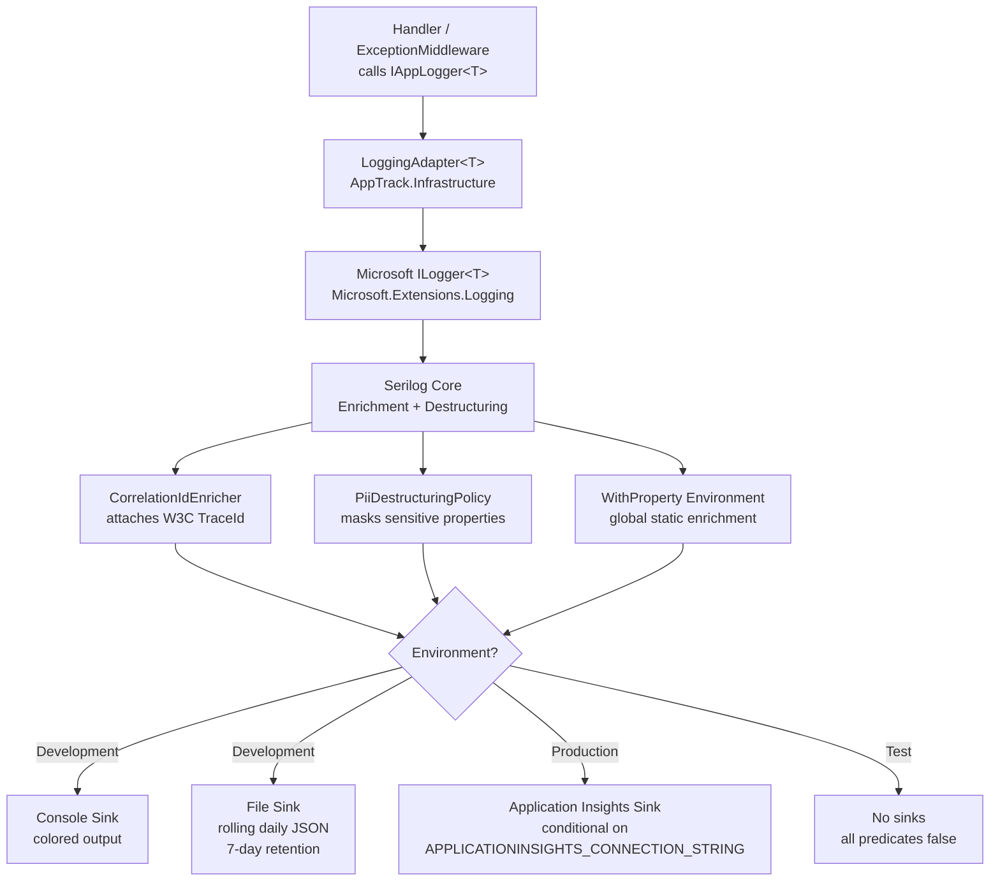
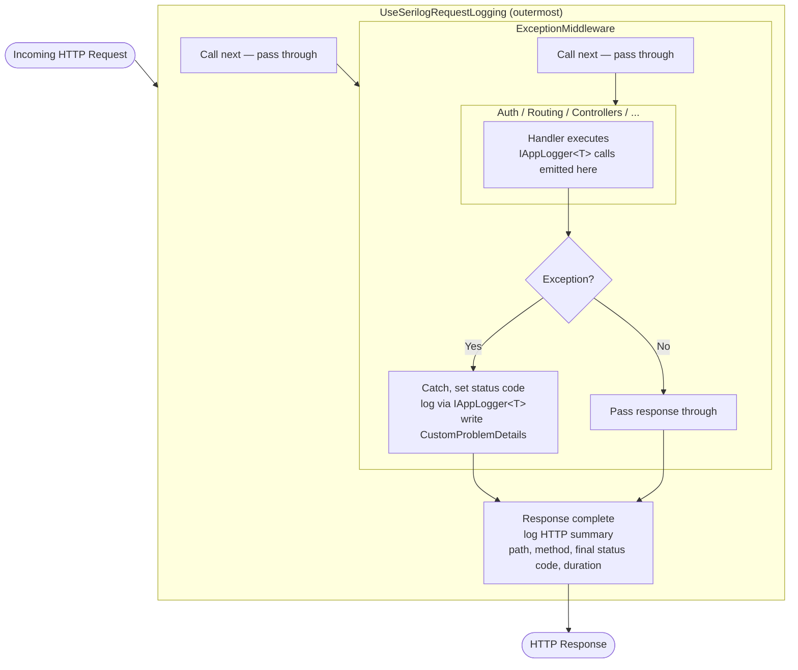
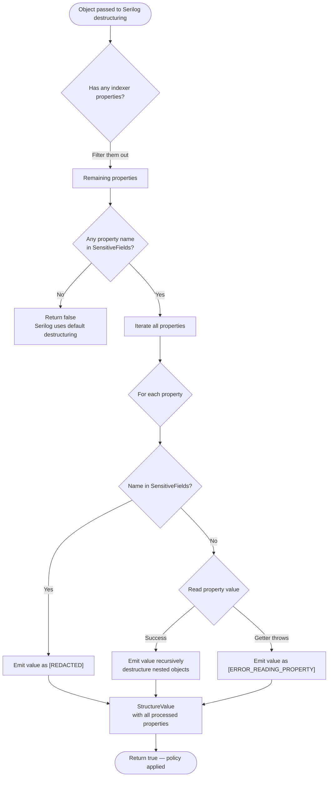

# Logging Architecture

## Overview

AppTrack uses **Serilog** as the structured logging backend, wired into the ASP.NET Core `Microsoft.Extensions.Logging` infrastructure via `builder.Host.UseSerilog()`. This means the existing `IAppLogger<T>` abstraction and `LoggingAdapter<T>` are completely unchanged — all handlers and middleware continue to call them exactly as before; Serilog simply becomes the backend that processes those calls.

| Concern | Implementation |
|---|---|
| Log abstraction | `IAppLogger<T>` (`AppTrack.Application`) |
| Log adapter | `LoggingAdapter<T>` (`AppTrack.Infrastructure`) |
| Log backend | Serilog, wired via `builder.Host.UseSerilog()` |
| HTTP request logging | `UseSerilogRequestLogging` (outermost middleware) |
| Correlation tracking | W3C TraceId via `CorrelationIdEnricher` |
| PII protection | `PiiDestructuringPolicy` (object destructuring masking) |
| Development output | Console (colored) + rolling daily JSON file |
| Production output | Application Insights (conditional on env var) |
| Test output | No sinks (all suppressed by environment predicate) |

---

## Log Event Flow



Additionally, `UseSerilogRequestLogging` emits one HTTP summary log event per request (path, method, status code, duration). This is separate from and complementary to the events emitted by `IAppLogger<T>`.

---

## Middleware Stack



The ordering is critical: `ExceptionMiddleware` sets the final status code before control returns to `UseSerilogRequestLogging`, so the HTTP summary always reflects the correct 4xx/5xx status rather than an unset or default value.

The two layers log different things and do not overlap:

| Middleware | What it logs |
|---|---|
| `UseSerilogRequestLogging` | One `Information`-level summary per request: path, method, status code, elapsed time, `UserId` (from `sub` claim) |
| `ExceptionMiddleware` | Exception details: type, message, stack trace (for unhandled exceptions). Level depends on exception type — see the Error Handling Architecture doc. |

---

## Enrichment

Every log event automatically carries the following properties:

| Property | Mechanism | Value |
|---|---|---|
| `CorrelationId` | `CorrelationIdEnricher` (custom `ILogEventEnricher`) | W3C `Activity.Current?.TraceId`; `"none"` if no active Activity |
| `Environment` | `.Enrich.WithProperty(...)` in `UseSerilog()` | `Development`, `Production`, `Test`, etc. |
| `UserId` | `EnrichDiagnosticContext` in `UseSerilogRequestLogging` | JWT `sub` claim (GUID); absent in non-HTTP contexts |

`CorrelationId` uses `AddPropertyIfAbsent` so it can never overwrite a value already present on the log event.

`UserId` is only available within an HTTP request context. In non-HTTP contexts (startup, background jobs) it is simply absent from the log event — there is no fallback value.

`Environment` is attached globally to every log event, including bootstrap events. It is not set again via `EnrichDiagnosticContext` to avoid redundancy.

---

## PII Protection

The `PiiDestructuringPolicy` class (`AppTrack.Api/Logging/PiiDestructuringPolicy.cs`) implements `IDestructuringPolicy`. It intercepts any object passed to Serilog's destructuring operator (`{@param}`) and masks known sensitive property names.

### Masked Fields

The following property names are matched case-insensitively:

`Password`, `ApiKey`, `Token`, `Email`, `Name`, `GivenName`, `FamilyName`

### PiiDestructuringPolicy Decision Flow



The policy only triggers on objects that have at least one sensitive property name. Objects with no matching property names are left to Serilog's default destructuring, which avoids unnecessary overhead.

In addition to the destructuring policy, request body logging is never enabled — `UseSerilogRequestLogging` captures only the HTTP summary (path, method, status code, duration). The `Authorization` header is excluded from any header logging.

---

## Sinks per Environment

Sinks are selected via `WriteTo.Conditional` predicates evaluated against the hosting environment name at startup. The environment name is captured from `context.HostingEnvironment.EnvironmentName` inside `UseSerilog()`.

| Environment | Console | File (JSON) | Application Insights |
|---|---|---|---|
| `Development` | Yes | Yes | No |
| `Production` | No | No | Yes (if connection string set) |
| `Test` | No | No | No |
| Any other | No | No | No |

The Application Insights sink additionally requires the environment variable `APPLICATIONINSIGHTS_CONNECTION_STRING` to be set. If the variable is absent, the sink is silently skipped with no code change needed.

### File Sink (Development)

- Format: JSON Lines via `CompactJsonFormatter` (one JSON object per line)
- Path: `logs/apptrack-.log` (relative to process working directory)
- Rolling interval: daily
- Retention: 7 files

---

## Log Levels

Log levels are driven by `appsettings.json` (base) merged with the environment-specific override file.

| Source | Default level | `Microsoft.*` / `System.*` |
|---|---|---|
| `appsettings.json` | `Information` | `Warning` |
| `appsettings.Development.json` | `Debug` | inherits `Warning` |
| `appsettings.Production.json` | `Warning` | inherits `Warning` |

The effective level matrix at runtime:

| Source | Development | Production |
|---|---|---|
| Application code via `IAppLogger<T>` | `Information`+ (no `LogDebug` on `IAppLogger<T>`) | `Warning`+ |
| Serilog infrastructure (e.g., `UseSerilogRequestLogging`) | `Debug`+ | `Warning`+ |
| `Microsoft.*` namespaces | `Warning`+ | `Warning`+ |
| `System.*` namespaces | `Warning`+ | `Warning`+ |

`IAppLogger<T>` exposes only `LogInformation`, `LogWarning`, and `LogError`. The `Debug` log level is therefore only emitted by Serilog's own infrastructure components — not by application handler code.

---

## Bootstrap Logger

A minimal bootstrap logger is created before `WebApplication.CreateBuilder` runs, so that fatal errors during host construction (configuration loading, service registration) are captured:

```csharp
Log.Logger = new LoggerConfiguration()
    .WriteTo.Console()
    .CreateBootstrapLogger();
```

This logger writes to the console unconditionally and is replaced by the full Serilog configuration once the host is built via `UseSerilog()`. Any events emitted by the bootstrap logger will not include enrichment properties such as `CorrelationId` or `Environment`.

If the host fails to start entirely, the `catch` block at the top level calls `Log.Fatal(ex, "Application terminated unexpectedly")` before `Log.CloseAndFlushAsync()` is awaited.

---

## Configuration Reference

### `appsettings.json` (base — all environments)

```json
"Serilog": {
  "MinimumLevel": {
    "Default": "Information",
    "Override": {
      "Microsoft": "Warning",
      "System": "Warning"
    }
  }
}
```

### `appsettings.Development.json`

```json
"Serilog": {
  "MinimumLevel": {
    "Default": "Debug"
  }
}
```

### `appsettings.Production.json`

```json
"Serilog": {
  "MinimumLevel": {
    "Default": "Warning"
  }
}
```

Sink wiring (console, file, Application Insights) is configured in code in `Program.cs` via `WriteTo.Conditional` predicates, not via `appsettings.json`. The configuration files control only log level floors.

---

## Integration Test Impact

API integration tests in `AppTrack.Api.IntegrationTests` use `WebApplicationFactory<Program>` with `Testcontainers`. `FakeAuthWebApplicationFactory.ConfigureWebHost` sets `builder.UseEnvironment("Test")`, which causes all Serilog sink predicates to evaluate to false — no output is written to the console or to files during test runs.

`FakeAiTextWebApplicationFactory` and `FakeCvStorageWebApplicationFactory` both call `base.ConfigureWebHost(builder)` and therefore inherit the `Test` environment automatically.

The bootstrap logger (created before `WebApplicationFactory` builds the host) uses an unconditional console sink, but it emits at most one or two events per test run during startup and does not affect test output meaningfully.

---

## NuGet Packages

Serilog packages are referenced with **inline versions** directly in `AppTrack.Api.csproj`, consistent with the existing inline versioning convention in that project.

| Package | Version | Purpose |
|---|---|---|
| `Serilog.AspNetCore` | 8.0.3 | `UseSerilog()` host integration + `UseSerilogRequestLogging` |
| `Serilog.Sinks.File` | 6.0.0 | Rolling file sink (development) |
| `Serilog.Sinks.ApplicationInsights` | 5.0.1 | Azure Monitor sink (production) |

`Serilog.Sinks.Console` is included transitively via `Serilog.AspNetCore` and does not need a separate reference. The `CompactJsonFormatter` used by the file sink is included in `Serilog.Formatting.Compact`, which is also a transitive dependency of `Serilog.AspNetCore`.

---

## Key Files

| File | Purpose |
|---|---|
| `AppTrack.Api/Program.cs` | Bootstrap logger, `UseSerilog()` wiring, middleware registration order |
| `AppTrack.Api/Logging/CorrelationIdEnricher.cs` | Custom `ILogEventEnricher` — attaches W3C TraceId |
| `AppTrack.Api/Logging/PiiDestructuringPolicy.cs` | Custom `IDestructuringPolicy` — masks sensitive property values |
| `AppTrack.Api/appsettings.json` | Base Serilog level configuration |
| `AppTrack.Api/appsettings.Development.json` | Debug level override |
| `AppTrack.Api/appsettings.Production.json` | Warning level override |
| `AppTrack.Infrastructure/Logging/LoggingAdapter.cs` | Bridges `IAppLogger<T>` to `Microsoft.ILogger<T>` (unchanged) |
| `AppTrack.Application/Contracts/Logging/IAppLogger.cs` | Application-layer logging abstraction (unchanged) |
| `AppTrack.Api.IntegrationTests/WebApplicationFactory/FakeAuthWebApplicationFactory.cs` | Sets `UseEnvironment("Test")` to suppress all sinks |
