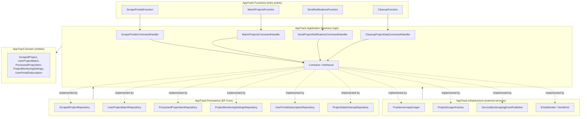
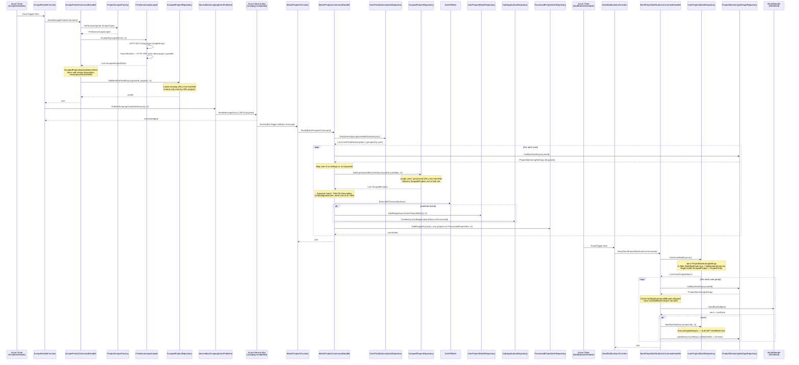
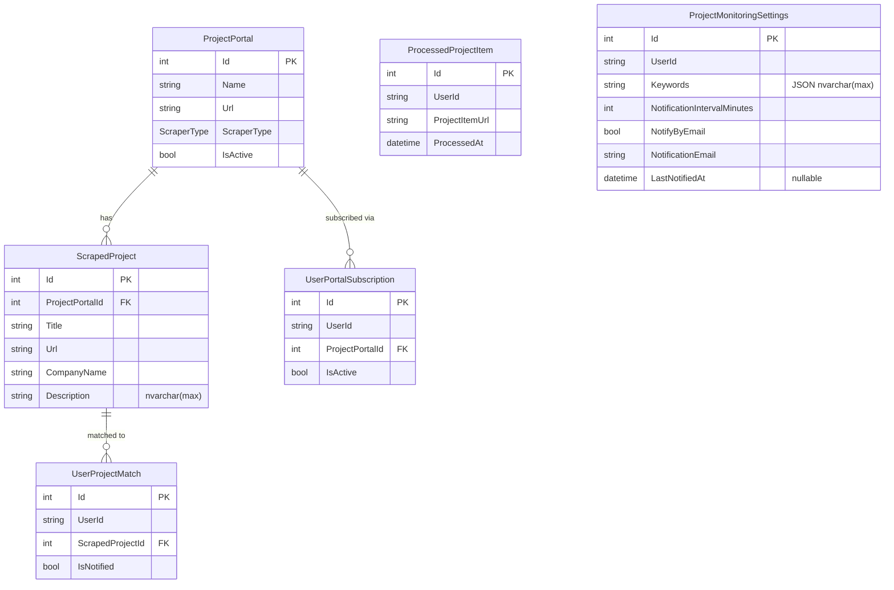

# Project Monitoring Architecture

## Overview

The Project Monitoring feature automatically discovers freelance projects from external portals,
matches them against each user's keywords, creates `JobApplication` records for matches, and
sends email digest notifications. The feature runs entirely as background work with no user-facing
HTTP requests involved in its core pipeline.

**Entry points:** Azure Functions v4 (Isolated Worker, .NET 10)
**Messaging:** Azure Service Bus (Basic SKU, single queue)
**Persistence:** Azure SQL Server via EF Core 10
**Email:** SendGrid via `IEmailSender`

The pipeline has three stages that execute in sequence, plus a periodic cleanup job:

| Stage | Trigger | Function | Command |
|---|---|---|---|
| 1. Scrape | Timer (`ScrapeSchedule`) | `ScrapePortalsFunction` | `ScrapePortalsCommand` |
| 2. Match | Service Bus queue message | `MatchProjectsFunction` | `MatchProjectsCommand` |
| 3. Notify | Timer (`NotificationSchedule`) | `SendNotificationsFunction` | `SendProjectNotificationsCommand` |
| 4. Cleanup | Timer (`CleanupSchedule`) | `CleanupFunction` | `CleanupProjectDataCommand` |

---

## Clean Architecture Layers

All business logic lives in the Application layer. The Functions project is a thin entry-point layer
that wires Azure triggers to Mediator dispatches — identical in role to an ASP.NET controller.



### Dependency injection in `AppTrack.Functions/Program.cs`

The Functions host reuses the same service registration extensions as the API:

```
services.AddApplicationServices()
services.AddInfrastructureServices(configuration)
services.AddPersistanceServices(configuration)
services.AddScoped<IUserContext, NullUserContext>()   // overrides HttpContextUserContext
```

`NullUserContext` replaces the HTTP-context-based implementation because timer-triggered
functions have no HTTP request. It throws `InvalidOperationException` on `GetCurrentUserId()`
to guard against accidentally dispatching a user-scoped command from a function.

---

## Full Pipeline Sequence Diagram



---

## Component Reference

### Azure Functions (entry points)

| Class | Trigger | Responsibility |
|---|---|---|
| `ScrapePortalsFunction` | `TimerTrigger(%ScrapeSchedule%)` | Dispatches `ScrapePortalsCommand`, then calls `IScrapingEventPublisher.PublishScrapingCompletedAsync` |
| `MatchProjectsFunction` | `ServiceBusTrigger(%ScrapingCompletedQueueName%)` | Dispatches `MatchProjectsCommand` when a scraping-completed message arrives |
| `SendNotificationsFunction` | `TimerTrigger(%NotificationSchedule%)` | Dispatches `SendProjectNotificationsCommand` on a frequent schedule |
| `CleanupFunction` | `TimerTrigger(%CleanupSchedule%)` | Dispatches `CleanupProjectDataCommand` to delete data older than 60 days |

### Application Layer — Commands

**`ScrapePortalsCommandHandler`**
- Loads all active `ProjectPortal` records via `IProjectPortalRepository`
- Resolves the correct `IProjectScraper` via `IProjectScraperFactory` (keyed on `ScraperType` enum)
- Runs `ScrapedProjectDataValidator.Validate(item)` against each result — skips items with empty description, missing/oversized title, URL, or company name
- Calls `IScrapedProjectRepository.AddNewForPortalAsync` — deduplication by URL occurs in the repository

**`MatchProjectsCommandHandler`**
- Loads all active `UserPortalSubscription` records, groups by user
- Per user: loads `ProjectMonitoringSettings`; skips if settings are absent or keyword list is empty
- Calls `GetUnprocessedForUserAsync` to obtain projects not yet seen by this user
- Matches: a project is a match if any keyword appears (case-insensitive ordinal) in `Title` OR `Description`
- Wraps all writes for a single user in `IUnitOfWork.ExecuteInTransactionAsync`:
  - Matched projects create `UserProjectMatch` (IsNotified=false) and a `JobApplication` (Status=Discovered)
  - ALL new projects (matched or not) are added to `ProcessedProjectItem`

**`CleanupProjectDataCommandHandler`**
- Computes a cutoff of `DateTime.UtcNow - 60 days`
- Calls `IProjectDataCleanupRepository.CleanupOlderThanAsync(cutoff, ct)`
- Deletion order is fixed by the Restrict FK from `UserProjectMatch` → `ScrapedProject`:
  1. `UserProjectMatches` where `ScrapedProject.CreationDate < cutoff`
  2. `ProcessedProjectItems` where `ProcessedAt < cutoff`
  3. `ScrapedProjects` where `CreationDate < cutoff`
- Uses `ExecuteDeleteAsync` — no entity loading, single `DELETE` statement per table

**`SendProjectNotificationsCommandHandler`**
- Loads unnotified matches via `IUserProjectMatchRepository.GetUnnotifiedAsync` (pre-filtered to users with `NotifyByEmail=true` and a non-empty `NotificationEmail`)
- Per user: checks whether `NotificationIntervalMinutes` has elapsed since `LastNotifiedAt`
- On successful email send: bulk-updates `IsNotified=true` via `ExecuteUpdateAsync`, then updates `LastNotifiedAt`

### Infrastructure Layer

| Class | Interface | Description |
|---|---|---|
| `FreelancermapScraper` | `IProjectScraper` | Fetches listing page with AngleSharp, then fetches all detail pages in parallel (`Task.WhenAll`), extracts `.ql-editor` text as description. Uses `AddStandardResilienceHandler` (3 retries, exponential backoff). |
| `ProjectScraperFactory` | `IProjectScraperFactory` | Switch on `ScraperType` enum; currently only `ScraperType.FreelancerMap` is supported. |
| `ServiceBusScrapingEventPublisher` | `IScrapingEventPublisher` | Creates a `ServiceBusClient` per call, sends a JSON message with `PortalIds` array. Configuration keys: `ServiceBus:ConnectionString`, `ProjectScraping:TopicName`. |
| `EmailSender` | `IEmailSender` | SendGrid integration, configured via `EmailSettings`. |

### Persistence Layer — Key Repository Methods

| Method | Description |
|---|---|
| `ScrapedProjectRepository.AddNewForPortalAsync` | Loads existing URLs for the portal into a `HashSet`, inserts only projects whose URL is not present. Never deletes existing records. |
| `ScrapedProjectRepository.GetUnprocessedForUserAsync` | Loads the user's `ProcessedProjectItems` URLs into a `HashSet`, then returns `ScrapedProjects` from the subscribed portals whose URL is not in that set. |
| `UserProjectMatchRepository.GetUnnotifiedAsync` | Two-step query: first fetches eligible user IDs from `ProjectMonitoringSettings`; then loads `UserProjectMatches` with `IsNotified=false` for those users, eager-loading `ScrapedProject` and `ProjectPortal`. |
| `UserProjectMatchRepository.MarkNotifiedAsync` | Uses `ExecuteUpdateAsync` for a single bulk `UPDATE` — no entity tracking overhead. |
| `ProjectDataCleanupRepository.CleanupOlderThanAsync` | Deletes in FK-safe order: `UserProjectMatches` → `ProcessedProjectItems` → `ScrapedProjects`. Uses `ExecuteDeleteAsync` for each table. |

### Domain Entities



**Unique constraints:**
- `ScrapedProjects`: `(ProjectPortalId, Url)` — global URL deduplication per portal
- `ProcessedProjectItems`: `(UserId, ProjectItemUrl)` — per-user processing record
- `UserProjectMatches`: `(UserId, ScrapedProjectId)` — prevents duplicate match records
- `ProjectMonitoringSettings`: `UserId` — one settings record per user

`Keywords` is stored as a JSON array in a single `nvarchar(max)` column, serialized by EF Core value conversion.

---

## Key Design Decisions

### The `ProcessedProjectItem` Pattern

`ScrapedProject` is a global table — a project scraped from Freelancermap exists once, not once per user. To determine which projects a user has already seen, the system maintains `ProcessedProjectItem` as a per-user log of processed URLs.

`GetUnprocessedForUserAsync` loads the user's processed URL set in memory, then queries `ScrapedProjects` excluding those URLs. This avoids an outer-join query that would become expensive as `ProcessedProjectItems` grows, trading memory for query simplicity.

ALL new projects are written to `ProcessedProjectItem` at the end of each matching pass — not just matches. This means a project that does not match a user's keywords today will not be reconsidered on the next scraping cycle, even if the user later adds relevant keywords. This is intentional: it prevents retroactive re-evaluation of historical data and keeps the pipeline predictable.

### Short-Circuit Keyword Matching

Matching evaluates `Title` before `Description`:

```csharp
settings.Keywords.Any(kw =>
    p.Title.Contains(kw, StringComparison.OrdinalIgnoreCase) ||
    p.Description.Contains(kw, StringComparison.OrdinalIgnoreCase))
```

Because `||` short-circuits, a title match avoids scanning the full description (which can be several kilobytes of text). This is a CPU optimization relevant when a user has many keywords and many new projects to evaluate.

### Transaction Per User in the Matching Stage

`MatchProjectsCommandHandler` wraps all writes for a single user in `IUnitOfWork.ExecuteInTransactionAsync`. If any write fails for user A, only user A's data is rolled back; other users' matching results are committed independently. This limits the blast radius of a single failure.

### Service Bus as Stage Boundary

Scraping and matching are decoupled via Azure Service Bus rather than being called sequentially within a single function. This provides:
- **Retry durability** — if `MatchProjectsFunction` fails, the Service Bus message is redelivered according to its retry policy without re-running the scraping stage.
- **Independent scaling** — scraping and matching can be scaled or re-triggered independently.
- **Observability** — the queue provides a natural checkpoint; a dead-letter queue captures unprocessable messages.

### Data Retention via `CleanupFunction`

`ScrapedProject`, `ProcessedProjectItem`, and `UserProjectMatch` records accumulate indefinitely without cleanup. A weekly `CleanupFunction` (Sunday 03:00 UTC) deletes all rows older than **60 days**.

`JobApplication` records are explicitly excluded from cleanup — they belong to the user's job tracker and must persist regardless of age.

The 60-day retention window is a constant (`RetentionDays`) in `CleanupProjectDataCommandHandler`. Projects older than 60 days are no longer relevant for active job searching, and their associated match/processed records have no further use once the notification cycle has completed.

### Notification Interval Enforcement in the Handler

`SendNotificationsFunction` runs on a frequent schedule (e.g. every 5 minutes), but the handler enforces a per-user `NotificationIntervalMinutes` by comparing `LastNotifiedAt` to `DateTime.UtcNow`. This lets the function run frequently for responsiveness while preventing notification spam. The timer schedule controls the maximum resolution; user settings control actual frequency.

### `NullUserContext` in the Functions Host

The Functions host registers `NullUserContext` after `AddInfrastructureServices`, overriding the `HttpContextUserContext` that requires an active HTTP request. `NullUserContext.IsAuthenticated` returns `false` and `GetCurrentUserId()` throws. The Mediator pipeline's user-scoped request check uses `IsAuthenticated` as a gate, so any accidental dispatch of an `IUserScopedRequest` from a function will fail fast at runtime rather than silently using a null user ID.

---

## Local Development

### Azurite Limitation

Azurite supports Azure Blob Storage and Azure Queue Storage, but **not Azure Service Bus**. As a result, `MatchProjectsFunction` cannot be triggered via queue locally using Azurite.

### Option 1 — Manual Admin Triggers (no real Service Bus)

Set `ServiceBusConnection` to any non-empty placeholder in `local.settings.json`. The `ServiceBusScrapingEventPublisher` will fail when it attempts to publish, preventing the queue message from being sent and therefore preventing `MatchProjectsFunction` from triggering automatically.

To run the full pipeline manually:

1. Start Azurite: `azurite --silent`
2. Start the Functions host: `func start` in `AppTrack.Functions/`
3. Trigger scraping via the HTTP admin endpoint:
   ```
   POST http://localhost:7071/admin/functions/ScrapePortalsFunction
   Content-Type: application/json
   {}
   ```
4. Trigger matching manually:
   ```
   POST http://localhost:7071/admin/functions/MatchProjectsFunction
   Content-Type: application/json
   {}
   ```
5. Trigger notifications manually:
   ```
   POST http://localhost:7071/admin/functions/SendNotificationsFunction
   Content-Type: application/json
   {}
   ```

### Option 2 — Real Azure Service Bus (recommended for end-to-end testing)

1. Create a Service Bus namespace in Azure (Basic SKU is sufficient)
2. Create a queue named `scraping-completed`
3. Copy the primary connection string into `local.settings.json` under `ServiceBusConnection`
4. Run `func start` — scraping will automatically trigger matching via the queue

### `local.settings.json`

```json
{
  "IsEncrypted": false,
  "Values": {
    "AzureWebJobsStorage": "UseDevelopmentStorage=true",
    "FUNCTIONS_WORKER_RUNTIME": "dotnet-isolated",
    "ScrapeSchedule": "0 */10 * * * *",
    "NotificationSchedule": "*/5 * * * *",
    "CleanupSchedule": "0 0 3 * * 0",
    "ScrapingCompletedQueueName": "scraping-completed",
    "ServiceBusConnection": "<real-connection-string-or-placeholder>",
    "ConnectionStrings__AppTrackConnectionString": "Server=(localdb)\\MSSQLLocalDB;Database=AppTrack_Local;Trusted_Connection=True;MultipleActiveResultSets=True;",
    "ServiceBus:ConnectionString": "<same-as-ServiceBusConnection>",
    "ProjectScraping:TopicName": "scraping-completed"
  }
}
```

> Note: `ServiceBusConnection` (no colon) is used by the `ServiceBusTrigger` binding attribute on `MatchProjectsFunction`. `ServiceBus:ConnectionString` is the configuration key read by `ServiceBusScrapingEventPublisher` to create the sender. Both must point to the same Service Bus namespace.

### Configuration Keys Reference

| Key | Used by | Description |
|---|---|---|
| `AzureWebJobsStorage` | Functions runtime | Azurite or Azure Storage for function state |
| `ScrapeSchedule` | `ScrapePortalsFunction` | NCRONTAB expression for scraping timer |
| `NotificationSchedule` | `SendNotificationsFunction` | NCRONTAB expression for notification timer |
| `ScrapingCompletedQueueName` | `MatchProjectsFunction` | Name of the Service Bus queue |
| `CleanupSchedule` | `CleanupFunction` | NCRONTAB expression for cleanup timer (e.g. `0 0 3 * * 0` = weekly Sunday 03:00 UTC) |
| `ServiceBusConnection` | `MatchProjectsFunction` trigger binding | Service Bus connection string (binding convention) |
| `ServiceBus:ConnectionString` | `ServiceBusScrapingEventPublisher` | Service Bus connection string (configuration key) |
| `ProjectScraping:TopicName` | `ServiceBusScrapingEventPublisher` | Queue/topic name for publishing; defaults to `project-scraping-events` |
| `ConnectionStrings__AppTrackConnectionString` | EF Core (Functions) | SQL Server connection string (double-underscore = section separator) |

---

## Constraints and Layer Boundaries

| Layer | Allowed | Not allowed |
|---|---|---|
| `AppTrack.Functions` | Inject `IMediator`, `IScrapingEventPublisher`, `ILogger<T>`; dispatch commands | Contain business logic; access repositories directly; access `DbContext` |
| `AppTrack.Application` | Orchestrate handlers; use contracts (interfaces); build domain entities | Reference EF Core, HTTP clients, Azure SDK, SendGrid |
| `AppTrack.Infrastructure` | Implement infrastructure contracts; use HttpClient, Azure SDK, SendGrid | Reference `AppTrackDatabaseContext`; reference `AppTrack.Persistance` |
| `AppTrack.Persistance` | Implement persistence contracts; use `AppTrackDatabaseContext` | Contain business logic; reference Infrastructure |
| `AppTrack.Domain` | Define entities, enums, value objects | Reference any other AppTrack project |
